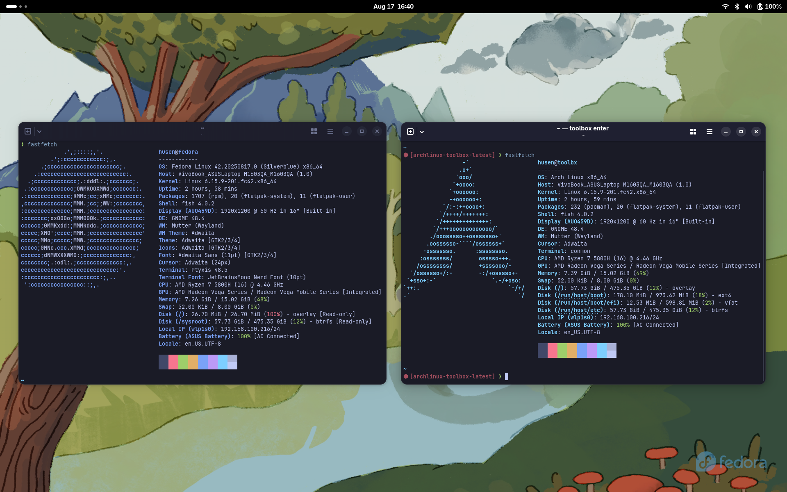

# Lightblue

 



## Why?

During my daily Linux experience, Fedora has been my longest-standing distro. I
love using it because it's so easy to use. It wasn't until I updated my Fedora
Workstation to version 42 that I ran into my first problem. There were
dependency issues with some packages I'd previously installed. The solution was
simple, but I didn't want to repeat the same process.

I already knew Fedora Atomic existed. But I always thought immutability wasn't
for me. Then, I discovered [BlueBuild](https://blue-build.org/). Finally, I
could build my own immutability system to my liking. So, I made this.

> This image is based on
[unofficial image](https://gitlab.com/fedora/ostree/ci-test) for Fedora bootable
container. Use at your own risk.

## Variant

| Image                                     | Base                                        | DE / TWM  | Driver  |
| ----------------------------------------- | ------------------------------------------- | --------- | ------- |
| ghcr.io/heyhusen/lightblue                | quay.io/fedora-ostree-desktops/silverblue   | Gnome     | AMD     |
| ghcr.io/heyhusen/lightblue-hyprland       | quay.io/fedora-ostree-desktops/base-atomic  | Hyprland  | AMD     |
| ghcr.io/heyhusen/lightblue-intel          | quay.io/fedora-ostree-desktops/silverblue   | Gnome     | Intel   |
| ghcr.io/heyhusen/lightblue-hyprland-intel | quay.io/fedora-ostree-desktops/base-atomic  | Hyprland  | Intel   |

## Features

- Remove unnecessary repositories, software and gnome extension
- Disable layering (with `rpm-ostree`)
- Install additional media codec from [RPM Fusion](https://rpmfusion.org/Howto/Multimedia?highlight=%28%5CbCategoryHowto%5Cb%29)
- Enable hardware video acceleration (with VAAPI)
- Install `helix` as main text editor, also `zed` and `vscode` for heavier task
- Install `mise` for manage per project tools
- Install `docker` and `compose` for devcontainer
- Replace `firefox` with `zen` as main browser
- Install Noto Sans and JetBrains Mono Nerd Font
- Apply Tokyo Night theme to every app (if it possible)
- Set up my [dotfiles](https://github.com/heyhusen/dotfiles) automatically

## Installation

This image is based on Fedora Atomic 42. So, make sure you already had that
version installed. Any variant should work.

This repo will build images weekly. So, if you want to update your system, simply
change the image tag to any available tag on [packages](https://github.com/heyhusen?tab=packages&repo_name=lightblue).

> After every each step bellow, your device will restart.

1.  First rebase to the unsigned image, to get the proper signing keys and
policies installed:

  ```sh
  sudo bootc switch --apply ghcr.io/heyhusen/lightblue:42
  ```
2. Then rebase to the signed image, like so:

  ```sh
  sudo bootc switch --enforce-container-sigpolicy --apply ghcr.io/heyhusen/lightblue:42
  ```

### Post Install (Optional)

This step is optional, but mandatory for me. You only need to run it once.

#### Set fish as default shell

```sh
sudo usermod --shell /usr/bin/fish $USER
```

#### Allow docker to run without sudo

```sh
sudo usermod -aG docker $USER
```

> After that, restart your device.

## Update
This is one of the advantages of Fedora Atomic. The update method is the same as
the installation method described above. Simply chose the version you wish to
update to.

## Verification

This image is signed with [Sigstore](https://www.sigstore.dev/)'s [cosign](https://github.com/sigstore/cosign). You can verify the signature by
downloading the `cosign.pub` file from this repo and running the following
command:

```sh
cosign verify --key cosign.pub ghcr.io/heyhusenn/Lightblue
```
